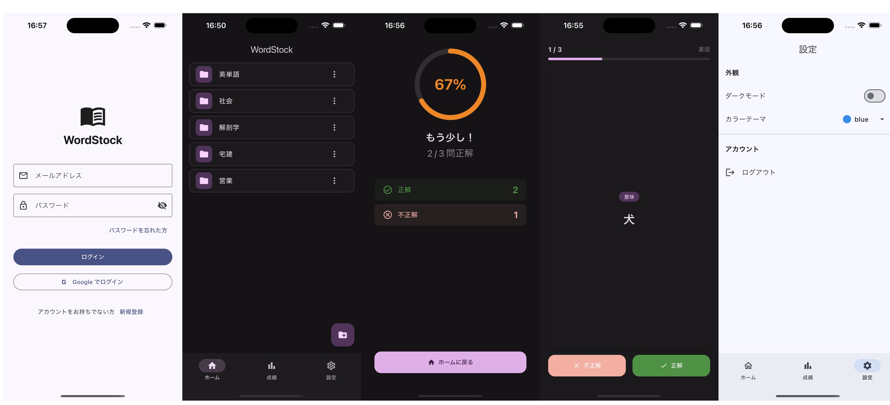
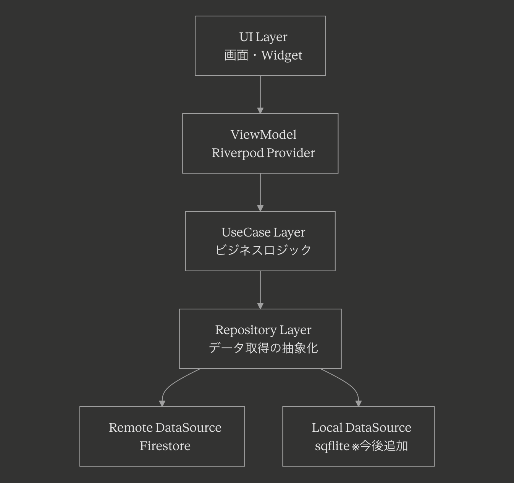

# WordStock2026

単語を自分で登録して学習できるフラッシュカード型単語帳アプリです。
フォルダ分けで教科や目的ごとに整理し、カードめくり形式のテストで記憶の定着をサポートします。
テスト結果の履歴も記録されるため、苦手な単語を重点的に復習することができます。

<p align="center">
  <em>📱 アプリのスクリーンショット（ログイン・単語一覧・テスト・設定）</em>
  <br>
  
</p>

## 設計思想

### アーキテクチャ選定
本アプリの規模であれば MVVM + Repository パターンが適切ですが、大規模開発への対応力を示すため、あえてクリーンアーキテクチャ（DDD）を採用しました。
UseCase レイヤーを設けることで、ビジネスロジックの独立性を担保し、将来的な機能拡張やテストの容易さを確保しています。
実務ではプロジェクトの規模と要件に応じて最適なアーキテクチャを選定します。

### アーキテクチャ

<p align="center">
  
</p>

#### 各レイヤーの責務
| レイヤー | 責務 | 主な構成要素 |
|---------|------|------------|
| presentation | 画面表示・ユーザー操作の受付 | Page / Widget / ViewModel (Notifier) / State |
| application | ユースケースの実行 | UseCase クラス |
| domain | ビジネスロジック・ルールの定義 | Entity / Repository（interface） |
| infrastructure | 外部サービスとの通信・データ変換 | RepositoryImpl / DataSource（Firebase・SQLiteローカルDB）/ 同期サービス |

#### 依存関係ルール
- `domain` 層は他のどの層にも依存しない
- `application` 層は `domain` 層のみに依存する
- `presentation` 層は `application` / `domain` 層に依存する
- `infrastructure` 層は `domain` 層（インターフェース / エンティティ）に依存する
- 依存性の注入（DI）は Riverpod で管理する（`core/di/` 配下の Provider 経由）

### 技術選定：Riverpod + Freezed
- **Riverpod**：グローバルな状態管理の柔軟性と、DI（依存性注入）によるテスタビリティの向上
- **Freezed**：コード自動生成（Generator）によるボイラープレートの削減と型安全性の確保
- この組み合わせにより、安全性・生産性・テスト容易性を両立しています

### オフライン同期対応
SQLite（sqflite）をローカルキャッシュとして導入し、UI層は常にSQLiteから読み取ることでオンライン/オフラインを意識しない設計にしています。
書き込み時はデータテーブルへの反映と `sync_queue` テーブルへの同期予約を同一トランザクションで行い、`connectivity_plus` によるネットワーク監視と組み合わせて未送信データをFirestoreへ同期します。
同期フロー・競合解決の詳細は [docs/online_offline.md](docs/online_offline.md) を参照してください。

### テスト方針
本プロジェクトのテストは、CI/CD パイプラインの実働証明を主目的としています。
網羅的なテストカバレッジよりも、パイプライン上でテストが正常に実行され、結果に基づいてデプロイが制御されることの検証に重点を置いています。

### CI/CD 設計
- GitHub Secrets に Firebase キーを設定し、本番同等の環境で CI テストを実行
- CI 通過後、CD で Firebase Security Rules を自動デプロイ
- 個人開発においてもチーム開発を想定したインフラ構成を採用

## 技術スタック
| カテゴリ | 技術 |
|---------|------|
| フレームワーク | Flutter 3.41.5 / Dart 3.11.3 |
| 状態管理 | Riverpod + Riverpod Generator |
| コード生成 | Freezed / build_runner |
| アーキテクチャ | クリーンアーキテクチャ（DDD） |
| バックエンド | Firebase（Firestore / Authentication） |
| ローカルDB・オフライン同期 | sqflite / connectivity_plus / sync_queue |
| CI/CD | GitHub Actions |
| バージョン管理 | FVM |
| テスト | Widget Test / Unit Test（mockito, sqflite_common_ffi） |

## 開発背景
転職活動のポートフォリオとして、Flutter での設計力・実装力・インフラ構築力を証明する目的で開発しました。

- 要件定義〜CI/CD 構築まで一人で対応
- 製造期間：2026/3/22〜3/24（3日間）
- テスト・CI/CD 構築：2026/3/29（1日）

## コミットルール

| プレフィックス | 用途 |
|--------------|------|
| feat | 新機能の追加 |
| fix | バグの修正 |
| docs | ドキュメントの変更 |
| style | コードのフォーマット変更（動作に影響しない） |
| refactor | リファクタリング（機能変更なし） |
| test | テストの追加・修正 |
| chore | ビルド設定・ツール関連の変更 |

参考：[コミットメッセージの書き方](https://times.hrbrain.co.jp/entry/how-to-write-commit-message-type)

## コード自動生成（Freezed / Riverpod）

1回だけ生成する:
```bash
fvm dart run build_runner build --delete-conflicting-outputs
```

ファイル変更を監視して自動生成し続ける:
```bash
fvm dart run build_runner watch --delete-conflicting-outputs
```

## テスト実行
```
fvm flutter test
```

## 要件定義書
コーディングに関するルールや設計方針は以下を参照してください。

[docs/requirements.md](docs/requirements.md)

なお、上記要件定義書には「オンライン必須・ローカルキャッシュ不採用」という記載がありますが、これは作成時点の古い記述です。
現在はオフライン同期対応へ移行中のため、最新の方針は [docs/online_offline.md](docs/online_offline.md) を参照してください。

<details>
<summary>環境構築手順（クリックで展開）</summary>

### 対応OS
- iOS 13.0以上
- Android 7.0（API 24）以上

### 動作確認済みバージョン
- Flutter 3.41.5
- Dart 3.11.3
- Xcode 26.4以上
- iOS 26.4以上
- CocoaPods 1.15.2以上
- Android Studio 2022.3 (Giraffe)以上（Android SDK 36）
- Android NDK 27.0
- Java 17以上

### 前提
- Flutterの環境構築が完了していること
公式からFlutterの環境構築を対応する

- Firebase CLIがインストール済みであること
```
  # 下記はFirebase CLI（コマンドラインツール）をインストールするコマンドです。
  npm install -g firebase-tools
```

- FVMがインストール済みであること
FVMは公式で調べて実施してください。

- プロジェクトのメンバーとして招待されてください。
・オーナーに問い合わせる（現在は受け付けていないので、以下手順の「非Firebase対応の環境構築」でビルドする）

### 非Firebase対応の環境構築
① Flutterの環境構築が完了していること

② FVMがインストール済みであること

③ Githubからローカル環境にmainブランチをクローンする

④ FVMにて、Flutter SDK をインストールする
```
fvm install 3.41.5
```

⑤ FVMにて、使用する Flutter バージョンを指定する
```
fvm use 3.41.5
```

⑥ 依存パッケージを取得する
```
fvm flutter pub get
```

⑦ ビルドを行う。以下どちらかの方法で起動する

**ターミナルから起動する場合:**
```
fvm flutter run --dart-define=USE_MOCKS=true
```

**VS Code から起動する場合（推奨）:**
実行とデバッグパネル（▶）→「WordStock (Dev - Mock)」を選択して実行

### Firebase対応の環境構築
① Flutterの環境構築が完了していること

② FVMがインストール済みであること

③ Firebase CLIがインストール済みであること

④ プロジェクトメンバーとして招待されていること（オーナーに問い合わせ）

⑤ Githubからローカル環境にmainブランチをクローンする

⑥ FVMにて、Flutter SDK をインストールする
```
fvm install 3.41.5
```

⑦ FVMにて、使用する Flutter バージョンを指定する
```
fvm use 3.41.5
```

⑧ FlutterFire CLI をインストールする
```
fvm dart pub global activate flutterfire_cli
```
> `flutterfire`コマンドが見つからない場合は`~/.pub-cache/bin`にPATHが通っているか確認してください。

⑨ Firebase にログインし、設定ファイルを生成する（`lib/firebase_options.dart` が生成される）
```
firebase login
flutterfire configure
```

⑩ Firebaseコンソールから各ファイルをダウンロードして配置する

Firebaseコンソール > 設定 > 全般 > 一番下までスクロール後、各ファイルをダウンロード

**Android:**
```
/word_stock_2026/android/app/google-services.json
```
**iOS:**
```
/word_stock_2026/ios/Runner/GoogleService-Info.plist
```

⑪ 環境変数の設定ファイルを配置する（担当者からもらってください）

⑫ 依存パッケージを取得する
```
fvm flutter pub get
```

⑬ ビルドを実行する
```
fvm flutter run
```

</details>